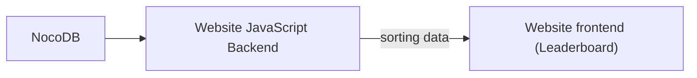

# High score website

This is the high score leaderboard for the floppy bird game. It is currently hosted using Netlify at [floppy bird high scores](https://floppybirdhighscores.netlify.app)

## How it works

This website uses NocoDB for the backend.

The api keys and NocoDB url are seperately entered in netlify as environment variables. That is why we have the `netlify/functions` directory with `scores.js` inside.
